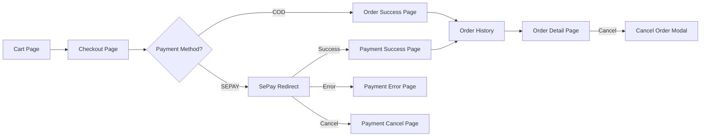

# 🛒 PLAN: Frontend API Integration — Checkout → Payment → Order History

> **Scope:** Hoàn thiện call API cho Frontend, thiết kế UI đẹp cho từng trang  
> **Thứ tự:** Checkout → Payment → Order History  
> **Tech:** React 19 + TypeScript + TailwindCSS 4 + Framer Motion + Axios

---

## Tổng Quan Luồng Hoạt Động



---

## Phase 1: Services & Types Layer (Nền tảng)

### 1.1 — [NEW] `src/types/order.types.ts`

TypeScript interfaces map từ Backend DTOs:

| Interface | Từ Backend DTO |
|---|---|
| `CheckoutValidation` | `ValidateCheckoutResponse` |
| `ShippingInfo` | `ShippingInfoResponse` |
| `PaymentMethod` | `PaymentMethodDto` |
| `CheckoutSummary` | `CheckoutSummaryDto` |
| `CreateOrderRequest` | `CreateOrderRequest` |
| `CheckoutResponse` | `CheckoutResponse` |
| `OrderResponse` | `OrderResponse` |
| `OrderDetailResponse` | `OrderDetailResponse` |
| `OrderItem` | `OrderItemResponse` |
| `OrderPayment` | `OrderPaymentResponse` |
| `PaymentStatus` | `PaymentStatusResponse` |
| `OrderFilter` | `OrderFilterRequest` |

Enums:
- `OrderStatus`: PENDING, CONFIRMED, SHIPPED, DELIVERED, CANCELLED
- `PaymentMethodEnum`: COD, SEPAY
- `PaymentStatusEnum`: PENDING, COMPLETED, FAILED, EXPIRED

### 1.2 — [NEW] `src/services/checkoutService.ts`

| Function | Method | Endpoint | Mô tả |
|---|---|---|---|
| `validateCheckout(couponCode?)` | POST | `/api/checkout/validate` | Validate cart + stock + shipping |
| `getShippingInfo()` | GET | `/api/checkout/shipping-info` | Lấy thông tin giao hàng user |
| `getPaymentMethods()` | GET | `/api/checkout/payment-methods` | Lấy danh sách payment methods |

### 1.3 — [NEW] `src/services/orderService.ts`

| Function | Method | Endpoint | Mô tả |
|---|---|---|---|
| `createOrder(data)` | POST | `/api/order/checkout` | Tạo order từ cart |
| `getMyOrders(filter?)` | GET | `/api/order/my-orders` | Lịch sử đơn hàng |
| `getOrderDetail(id)` | GET | `/api/order/{id}` | Chi tiết đơn hàng |
| `cancelOrder(id, reason)` | PUT | `/api/order/{id}/cancel` | Hủy đơn hàng |

### 1.4 — [NEW] `src/services/paymentService.ts`

| Function | Method | Endpoint | Mô tả |
|---|---|---|---|
| `getPaymentStatus(orderId)` | GET | `/api/payment/{orderId}/status` | Polling trạng thái thanh toán |
| `getSepayCheckoutUrl(orderId, urls)` | — | Build URL | Tạo URL redirect SePay |

---

## Phase 2: Checkout Page (Trang Thanh Toán)

### 2.1 — [NEW] `src/pages/Checkout/CheckoutPage.tsx`

**Luồng UI:**

```
┌─────────────────────────────────────────────────────┐
│  CHECKOUT PAGE                                       │
├─────────────────────────────────────────────────────┤
│                                                      │
│  ┌─────────────────────┐  ┌──────────────────────┐  │
│  │ LEFT COLUMN (60%)   │  │ RIGHT COLUMN (40%)   │  │
│  │                     │  │                      │  │
│  │ ① Shipping Info     │  │ Order Summary        │  │
│  │   - Name            │  │  - Cart Items List   │  │
│  │   - Email           │  │  - Subtotal          │  │
│  │   - Phone           │  │  - Shipping Fee      │  │
│  │   - Province        │  │  - Discount          │  │
│  │   - District        │  │  ─────────────────   │  │
│  │   - Ward            │  │  Total               │  │
│  │   - Street Address  │  │                      │  │
│  │                     │  │  [Place Order Button] │  │
│  │ ② Payment Method    │  │                      │  │
│  │   ○ COD             │  └──────────────────────┘  │
│  │   ○ SePay           │                             │
│  │                     │                             │
│  │ ③ Order Notes       │                             │
│  │   (optional)        │                             │
│  └─────────────────────┘                             │
│                                                      │
└─────────────────────────────────────────────────────┘
```

**API Flow khi vào trang:**
1. `GET /api/checkout/shipping-info` → Pre-fill thông tin user
2. `GET /api/checkout/payment-methods` → Hiển thị payment options
3. `POST /api/checkout/validate` → Validate cart + stock (nếu có coupon từ CartPage)

**API Flow khi submit:**
1. `POST /api/order/checkout` → Tạo order
2. Nếu COD → Redirect đến Success Page
3. Nếu SEPAY → Redirect đến `GET /api/payment/{orderId}/checkout?successUrl=...&errorUrl=...&cancelUrl=...`

### 2.2 — [NEW] `src/pages/Checkout/CheckoutPage.css`

UI Design: Glassmorphism form, clean layout, step indicators

### 2.3 — [NEW] `src/hooks/useCheckout.ts`

Custom hook quản lý checkout state:
- Shipping info form state + validation
- Payment method selection
- Coupon code (từ CartPage qua URL params hoặc state)
- Submit handler + loading/error states

### 2.4 — Components

| Component | File | Mô tả |
|---|---|---|
| `ShippingForm` | `src/components/checkout/ShippingForm/` | Form nhập thông tin giao hàng |
| `PaymentMethodSelector` | `src/components/checkout/PaymentMethodSelector/` | Chọn COD / SePay |
| `OrderReview` | `src/components/checkout/OrderReview/` | Tóm tắt đơn hàng + items |

---

## Phase 3: Payment Result Pages

### 3.1 — [NEW] `src/pages/Payment/PaymentSuccessPage.tsx`

**Khi nào hiển thị:** Sau khi SePay redirect về `?status=success&orderId=X&orderNumber=Y`

**UI:**
- ✅ Large success icon animation (Framer Motion)
- Order number display
- Total amount paid
- [Xem Chi Tiết Đơn Hàng] button → `/orders/{id}`
- [Tiếp Tục Mua Sắm] button → `/products`

### 3.2 — [NEW] `src/pages/Payment/PaymentErrorPage.tsx`

**Khi nào:** SePay redirect về với `?status=error`
- ❌ Error icon
- Error message
- [Thử Lại] button → Redirect lại SePay checkout
- [Quay Về Đơn Hàng] button

### 3.3 — [NEW] `src/pages/Payment/PaymentCancelPage.tsx`

**Khi nào:** User cancel trên SePay
- ⚠️ Cancel icon
- "Bạn đã hủy thanh toán" message
- [Thanh Toán Lại] button
- [Về Trang Chủ] button

### 3.4 — [NEW] `src/pages/Payment/PaymentPendingPage.tsx` (Đề xuất thêm)

**Khi nào:** Sau khi đặt đơn COD hoặc đơn SEPAY chờ xử lý
- ⏳ Animated pending icon
- Order info
- Nếu SEPAY: Polling `GET /api/payment/{orderId}/status` mỗi 5 giây
- Countdown timer (từ `RemainingSeconds`)
- Khi `IsPaid = true` → Auto redirect đến Success Page
- [Thanh Toán Ngay] button → SePay redirect

---

## Phase 4: Order History & Detail Pages

### 4.1 — [NEW] `src/pages/Orders/OrderHistoryPage.tsx`

**UI Layout:**

```
┌─────────────────────────────────────────────────────┐
│  ĐƠN HÀNG CỦA TÔI                                  │
├─────────────────────────────────────────────────────┤
│  [Search: ____]  [Status: All ▼]  [Date Range]      │
├─────────────────────────────────────────────────────┤
│  ┌──────────────────────────────────────────────┐   │
│  │ #ORD-2026001  │  23/02/2026  │  ₫350,000     │   │
│  │ 3 sản phẩm    │  CONFIRMED   │  SEPAY ✅     │   │
│  │ [Xem Chi Tiết]                               │   │
│  └──────────────────────────────────────────────┘   │
│  ┌──────────────────────────────────────────────┐   │
│  │ #ORD-2026002  │  22/02/2026  │  ₫150,000     │   │
│  │ 1 sản phẩm    │  PENDING     │  COD ⏳       │   │
│  │ [Xem Chi Tiết] [Hủy Đơn]                    │   │
│  └──────────────────────────────────────────────┘   │
│                                                      │
│  [← Prev]  1  2  3  [Next →]                       │
└─────────────────────────────────────────────────────┘
```

**API:** `GET /api/order/my-orders?page=1&pageSize=10&status=&searchTerm=`

### 4.2 — [NEW] `src/pages/Orders/OrderDetailPage.tsx`

**UI:** Hiển thị chi tiết đầy đủ:
- Order info header (order number, status badge, dates)
- Order timeline (Pending → Confirmed → Shipped → Delivered)
- Items list (hình ảnh, tên, số lượng, giá)
- Shipping info
- Payment info (method, status, reference)
- Order summary (subtotal, shipping, discount, total)
- Action buttons: [Hủy Đơn] (nếu status = PENDING), [Thanh Toán] (nếu SEPAY + PENDING)

**API:** `GET /api/order/{id}`

### 4.3 — [NEW] `src/hooks/useOrders.ts`

Custom hook:
- `orders`, `loading`, `error` states
- `fetchOrders(filter)` 
- `fetchOrderDetail(id)`
- `cancelOrder(id, reason)`
- Pagination state

### 4.4 — Components

| Component | Mô tả |
|---|---|
| `OrderCard` | Card hiển thị 1 đơn hàng trong list |
| `OrderTimeline` | Stepper hiển thị trạng thái đơn hàng |
| `OrderItemsList` | Danh sách sản phẩm trong đơn |
| `CancelOrderModal` | Modal xác nhận hủy đơn + nhập lý do |

---

## Phase 5: Routing & Navigation Updates

### 5.1 — [MODIFY] `src/App.tsx`

Thêm routes:

```tsx
// Checkout
<Route path="/checkout" element={<ProtectedRoute><CheckoutPage /></ProtectedRoute>} />

// Payment Result
<Route path="/payment/success" element={<PaymentSuccessPage />} />
<Route path="/payment/error" element={<PaymentErrorPage />} />
<Route path="/payment/cancel" element={<PaymentCancelPage />} />
<Route path="/payment/pending/:orderId" element={<ProtectedRoute><PaymentPendingPage /></ProtectedRoute>} />

// Orders
<Route path="/orders" element={<ProtectedRoute><OrderHistoryPage /></ProtectedRoute>} />
<Route path="/orders/:id" element={<ProtectedRoute><OrderDetailPage /></ProtectedRoute>} />
```

### 5.2 — [MODIFY] `src/components/common/Header/`

Thêm navigation link "Đơn hàng" cho authenticated users.

### 5.3 — [MODIFY] `src/pages/Cart/CartPage.tsx`

Cập nhật nút "Checkout" → Navigate đến `/checkout` thay vì hiện modal.

---

## Kế Hoạch Thực Thi (Theo Thứ Tự)

| Phase | Công việc | Files mới | Files sửa | Ước tính |
|---|---|---|---|---|
| **1** | Types + Services | 4 files | 0 | Nhỏ |
| **2** | Checkout Page + Components | ~7 files | 1 (CartPage) | Lớn |
| **3** | Payment Pages | 4 files | 0 | Trung bình |
| **4** | Order History + Detail | ~8 files | 0 | Lớn |
| **5** | Routing + Navigation | 0 | 2 (App.tsx, Header) | Nhỏ |

**Tổng:** ~23 files mới + ~3 files sửa

---

## Đề Xuất Thiết Kế Payment (SePay)

> [!IMPORTANT]
> **Đề xuất:** Sử dụng **SePay Redirect Flow** — đây là cách tốt nhất vì:
> 1. Backend đã implement sẵn `GET /api/Payment/{orderId}/checkout` → auto-submit form POST đến SePay
> 2. SePay xử lý toàn bộ payment security, PCI compliance
> 3. Frontend chỉ cần redirect user + xử lý callback pages
> 4. Có thêm PaymentPendingPage với polling để track trạng thái realtime

**Flow chi tiết:**
1. User chọn SEPAY → Submit order → `POST /api/order/checkout` 
2. Backend trả `CheckoutResponse` với `orderId`
3. FE redirect: `window.location = API_URL/api/Payment/{orderId}/checkout?successUrl=...&errorUrl=...&cancelUrl=...`
4. SePay xử lý thanh toán
5. SePay redirect → Backend callback → Backend redirect → FE Payment Success/Error/Cancel page
6. Nếu user quay lại app trước khi SePay redirect → PaymentPendingPage polling mỗi 5s

---

## Verification Plan

### Browser Testing
1. **Checkout Flow (COD):**
   - Vào Cart → Click Checkout → Kiểm tra shipping info pre-filled → Chọn COD → Đặt hàng → Verify redirect đến Success page
   
2. **Checkout Flow (SEPAY):**
   - Vào Cart → Checkout → Chọn SEPAY → Đặt hàng → Verify redirect đến SePay gateway

3. **Order History:**
   - Đặt hàng xong → Vào `/orders` → Verify đơn hàng hiển thị đúng → Click xem chi tiết → Verify thông tin đầy đủ

4. **Cancel Order:**
   - Vào Order Detail (status PENDING) → Click Hủy → Nhập lý do → Verify order cancelled

5. **Payment Error Pages:**
   - Trực tiếp vào `/payment/error?message=test` → Verify UI hiển thị đúng
   - Trực tiếp vào `/payment/cancel` → Verify UI

### Manual Verification (Cần bạn kiểm tra)
- Kiểm tra UI responsive trên mobile
- Kiểm tra tích hợp thực tế với Backend API (cần Backend đang chạy)
- Kiểm tra SePay sandbox payment (cần SePay test credentials)
